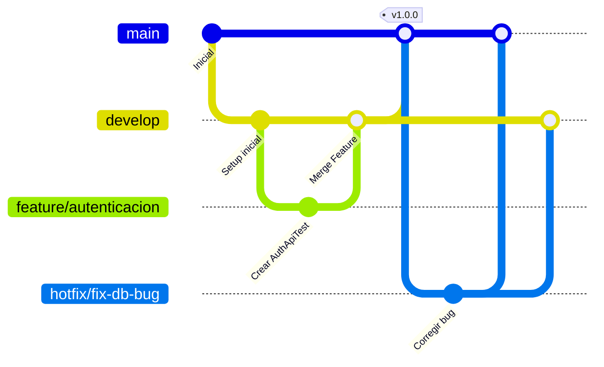

# Guía de Práctica: Laboratorio de DevOps & CI/CD
## Proyecto: BovWeight CR - API REST

Esta guía documenta la configuración del pipeline de Integración Continua (CI), el diseño del flujo de trabajo con Git, las directrices de Branch Protection y el procedimiento para realizar y documentar el laboratorio.

---

## 1. Explicación del Workflow (`ci.yml`)

El pipeline de CI automatiza la validación del código del API de Laravel cada vez que se realizan cambios en el repositorio. Garantiza que no se introduzcan errores de sintaxis, fallos de lógica o problemas de estilo en las ramas principales.

### Activación (Triggers)
El archivo [ci.yml](file:///c:/Users/emmi1/Documents/Act11-IngSW/Act11-IngSW-BoWeight/.github/workflows/ci.yml) está configurado para ejecutarse automáticamente bajo los siguientes eventos:
- **`push`** en la rama `main`.
- **`push`** en la rama `develop`.
- **`pull_request`** dirigido hacia la rama `main`.

### Jobs y Steps Ejecutados
El workflow contiene un único Job principal llamado **`laravel-tests`** (ejecutado sobre un contenedor limpio de `ubuntu-latest`) que realiza los siguientes pasos:

1. **Checkout del código**: Descarga el código fuente del repositorio mediante `actions/checkout@v4`.
2. **Configuración de PHP**: Instala PHP 8.3 con las extensiones indispensables (`mbstring`, `xml`, `ctype`, `iconv`, `mysql`, `sqlite`) mediante `shivamathur/setup-php@v2`.
3. **Caché de dependencias**: Detecta y almacena en caché las descargas de Composer para agilizar las ejecuciones del pipeline en ejecuciones consecutivas.
4. **Copia del entorno**: Copia `.env.example` como `.env` para tener las declaraciones base de variables de entorno de Laravel.
5. **Instalación de dependencias**: Ejecuta `composer install` de forma no interactiva para descargar todos los paquetes y librerías externas requeridas.
6. **Generación de APP_KEY**: Ejecuta `php artisan key:generate` para establecer la clave criptográfica de cifrado de la aplicación Laravel.
7. **Migración de Base de Datos**: Corre las migraciones del proyecto mediante `php artisan migrate --force` conectándose al contenedor MySQL provisto.
8. **Análisis Estático (Laravel Pint)**: Ejecuta `./vendor/bin/pint --test` para validar el formato del código según las reglas PSR-12/Laravel. Este paso tiene configurado `continue-on-error: true`. Esto se decidió así porque existen múltiples archivos preexistentes en la base del código que no cumplen con los estándares de estilo de Pint y los cuales no debemos modificar según las restricciones del laboratorio. De esta forma, el análisis de Pint es informativo y preventivo, sirviendo como auditoría de calidad sin bloquear de forma innecesaria el pipeline de CI por código heredado.
9. **Pruebas Unitarias y Funcionales**: Ejecuta `./vendor/bin/phpunit` (o `php artisan test`) para correr la suite de pruebas del API REST.

---

## 2. MySQL vs SQLite: Decisiones de Diseño

Una decisión arquitectónica crítica en este laboratorio es el uso de motores de base de datos diferenciados para el desarrollo local y el entorno de CI:

### Desarrollo Local: SQLite en memoria (`:memory:`)
- **Velocidad**: Las pruebas locales se ejecutan de manera instantánea porque SQLite funciona en memoria RAM sin necesidad de operaciones de disco ni latencia de red.
- **Portabilidad**: El estudiante no necesita instalar un servidor MySQL local para correr las pruebas, eliminando barreras de configuración inicial.

### Pipeline de CI (GitHub Actions): MySQL de prueba (`mysql:8.0`)
- **Paridad de Entornos**: El entorno de producción final de BovWeight CR corre sobre un motor relacional de tipo MySQL. Usar SQLite en el CI podría enmascarar errores de incompatibilidad en tipos de datos, restricciones de clave foránea o dialectos SQL específicos de MySQL.
- **Fiabilidad**: Validar las migraciones reales y las transacciones sobre un servidor MySQL auténtico asegura que el código está listo para ser desplegado.

> [!NOTE]
> En GitHub Actions levantamos MySQL a través de un servicio de contenedor Docker adjunto al runner, asegurando aislamiento y disponibilidad únicamente durante la ejecución de los tests.

---

## 3. Configuración de Branch Protection (Protección de Ramas)

Para evitar la alteración accidental del código en producción y asegurar la calidad del software, se debe configurar una regla de protección en GitHub para la rama principal:

### Instrucciones de Configuración en GitHub:
1. Navega a tu repositorio en GitHub.
2. Ve a **Settings** (Configuración) $\rightarrow$ **Branches** (Ramas) en la barra lateral izquierda.
3. En la sección *Branch protection rules*, haz clic en **Add rule** (Agregar regla).
4. Configura los siguientes parámetros obligatorios:
   - **Branch name pattern**: Escribe exactamente `main`.
   - Activa **Require a pull request before merging** (Requiere un pull request antes de fusionar).
     - *(Opcional)* Activa *Require approvals* y selecciona al menos `1`.
   - Activa **Require status checks to pass before merging** (Requiere que las comprobaciones de estado pasen antes de fusionar).
     - Marca la casilla **Require branches to be up to date before merging** (Requiere que las ramas estén actualizadas).
     - En el buscador de comprobaciones de estado, busca y selecciona el job: `Run Laravel Tests and Quality Checks`.
   - Activa **Do not allow bypassing the above settings** (No permitir omitir la configuración anterior). Esto aplica las restricciones incluso a los administradores del repositorio.
5. Presiona **Create** (Crear) para aplicar los cambios.

---

## 4. Estrategia de Ramas (Gitflow Simplificado)

Adoptamos la siguiente estrategia de ramificación para mantener un historial ordenado y evitar conflictos:



### Reglas por Rama:
- **`main`**: Código estable listo para producción.
  - *Políticas*: Bloqueada. Solo recibe cambios mediante Pull Requests validados desde `develop` o `hotfix/*` que tengan el pipeline de CI en verde y al menos una aprobación. No se permite *force push*.
- **`develop`**: Rama de integración continua.
  - *Políticas*: Pipeline obligatorio para cada commit. Se integra a través de Squash merge para mantener un historial limpio.
- **`feature/*`**: Ramas dedicadas al desarrollo de funcionalidades específicas.
  - *Políticas*: Creadas a partir de `develop` y fusionadas de vuelta a `develop` una vez finalizadas y aprobadas. El pipeline de CI corre en cada push.
- **`hotfix/*`**: Ramas de corrección rápida para resolver errores críticos en producción.
  - *Políticas*: Se abren a partir de `main` y se fusionan simultáneamente a `main` y a `develop`.

---

## 5. Guía de Evidencias para el Informe Final

El estudiante debe recopilar las siguientes capturas de pantalla de la plataforma de GitHub como prueba del correcto desarrollo del laboratorio:

1. **Ejecución Exitosa del Pipeline**: Captura de la sección *Actions* donde se muestre el workflow de CI finalizado con éxito (check verde) para un commit en `develop`.
2. **Tiempo Total y Step más Lento**: Captura detallada de la ejecución del workflow mostrando la duración de cada paso. Típicamente, el paso más lento suele ser la instalación de dependencias de Composer (`Install Dependencies`) o el levantamiento del contenedor MySQL.
3. **Pull Request Bloqueado por Prueba Fallida**: Captura de un Pull Request dirigido a `main` donde se observe el widget de GitHub bloqueando el botón de Merge porque las pruebas unitarias fallaron (CI en rojo).
4. **Branch Protection Activa**: Captura de la configuración en *Settings > Branches* que demuestre las reglas aplicadas sobre `main`.
5. **Historial de GitHub Actions**: Captura de la pantalla principal de Actions con la lista secuencial de pipelines ejecutados sobre el repositorio.

---

## 6. Procedimiento para Simular una Falla (Fase 5)

Para validar que la protección de ramas impide fusionar código defectuoso, sigue estos pasos:

### Paso 1: Crear una rama de pruebas
Crea y cámbiate a una rama llamada `feature/test-protection`:
```bash
git checkout -b feature/test-protection
```

### Paso 2: Provocar un fallo intencional en las pruebas
Abre el archivo [AuthApiTest.php](file:///c:/Users/emmi1/Documents/Act11-IngSW/Act11-IngSW-BoWeight/backend/tests/Feature/AuthApiTest.php) y altera deliberadamente una aserción. Por ejemplo, en la prueba de registro exitoso, cambia la aserción del código de respuesta:
```diff
- $response->assertStatus(201)
+ $response->assertStatus(500)
```

### Paso 3: Subir los cambios y crear un Pull Request
Sube los cambios a tu rama remota:
```bash
git add tests/Feature/AuthApiTest.php
git commit -m "feat: simulación de fallo para comprobación de CI"
git push origin feature/test-protection
```
Luego, entra a GitHub y abre un **Pull Request** desde la rama `feature/test-protection` apuntando hacia `main`.

### Paso 4: Comprobar el bloqueo
El pipeline de GitHub Actions se activará automáticamente y fallará al ejecutar `php artisan test`. Podrás observar que:
- El estado del PR cambia a "All checks have failed".
- El botón **Merge pull request** se encuentra deshabilitado y bloqueado (gris), mostrando el mensaje informando que se requiere que las pruebas pasen antes de poder fusionar.
- Toma la captura de pantalla requerida para tu evidencia.

### Paso 5: Restaurar el código original
Para solucionar el bloqueo, restaura el valor correcto del status en `AuthApiTest.php`, haz push nuevamente y observa cómo el pipeline se vuelve verde y habilita el merge.
